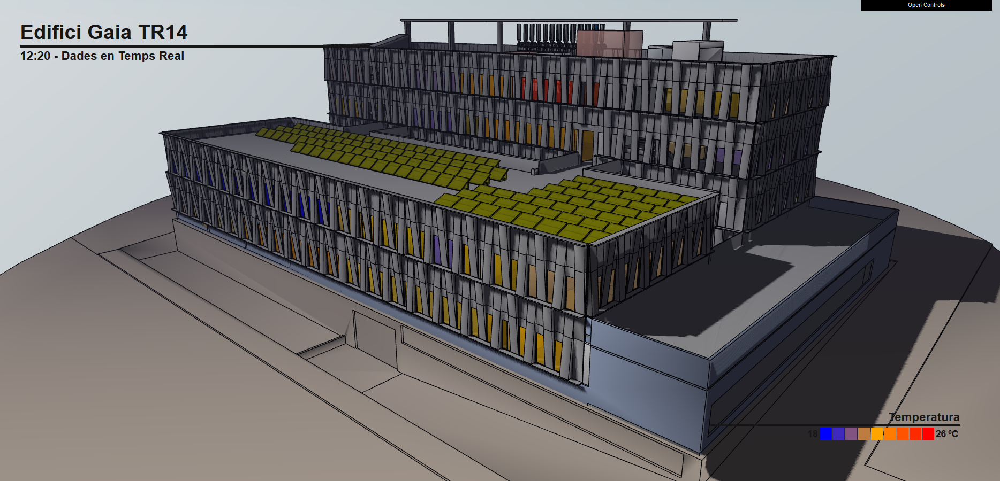
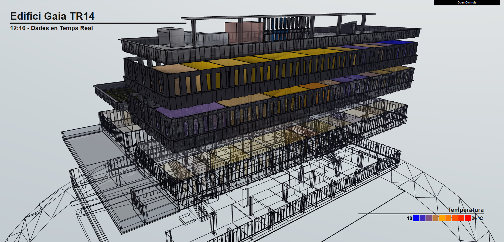

# building-viewer

Web application for displaying sensors in a 3D building view.
When it loads, it follows this sequence:

 1. Obtain the descriptor that specifies the model and sensors (JSON file). 
 
 2. Load the 3D model of the building (AMF file).
 
 3. Request the latest value of different sensors (e.g. office temperatures).

The following is a screenshot of the application:

The application performs a few animations:

## How it's made

The application consists of a web frontend module and a backend module.

The web frontend is implemented using:

 * AngularJS.
 * ThreeJS.
 * AMF model loader.
 * Webpack.

The backend is implemented using:

 * Spring Framework (Boot, MVC).
 * A bit of RxJava.
 * InfluxDB.

## Contributing

Feedback or contributions are welcome!

Please create an issue to discuss it first :)
